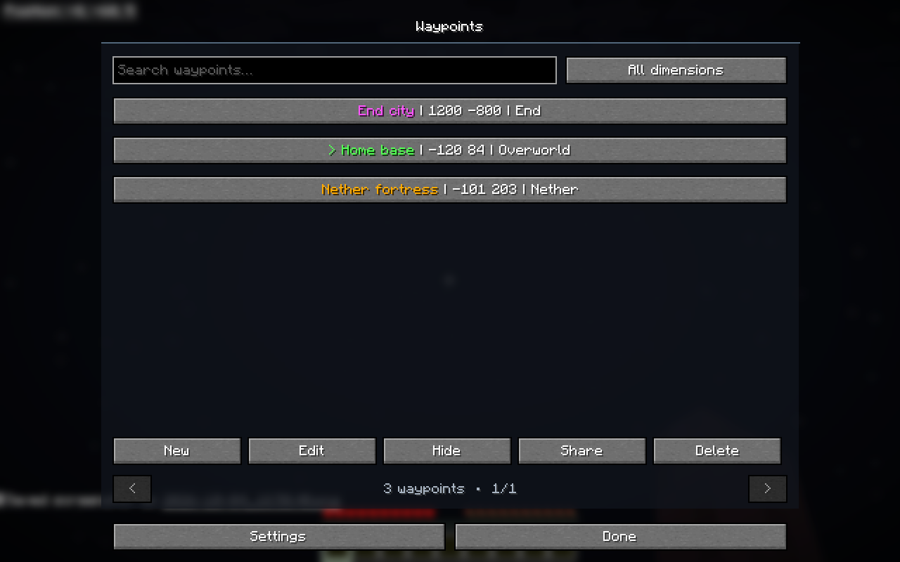
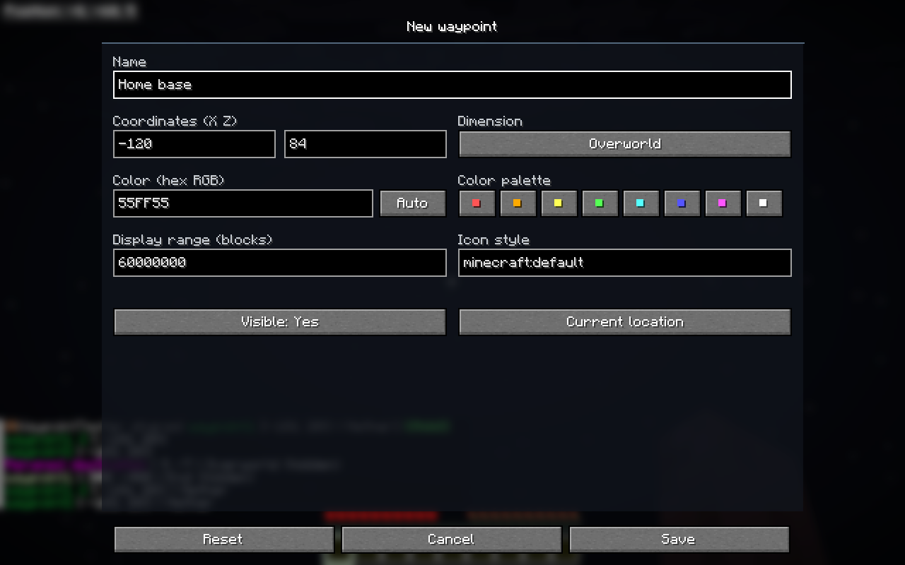
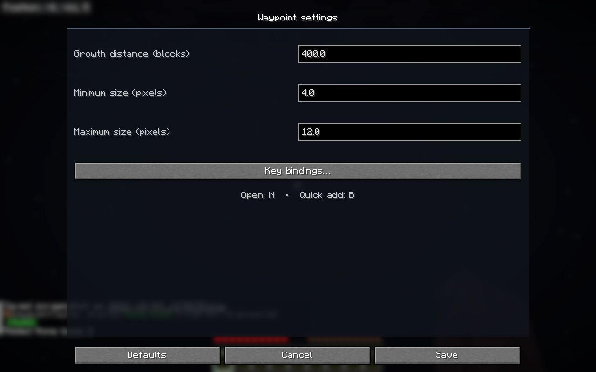
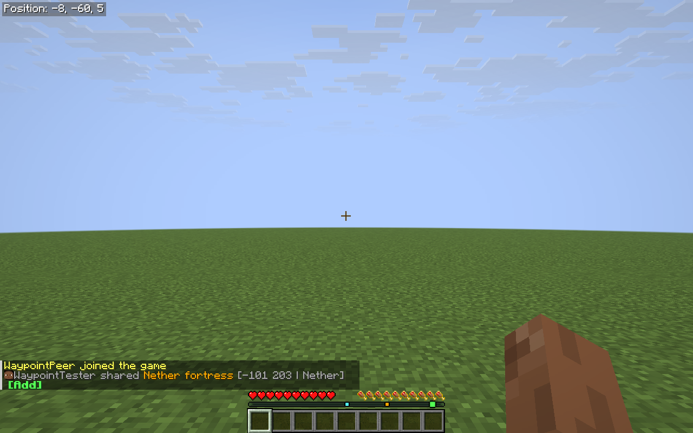
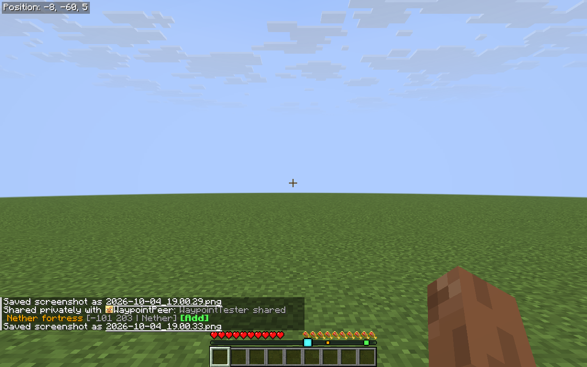
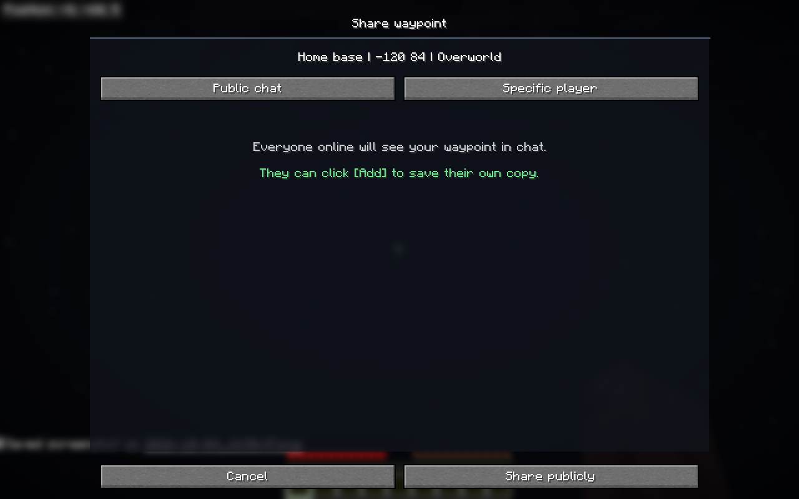
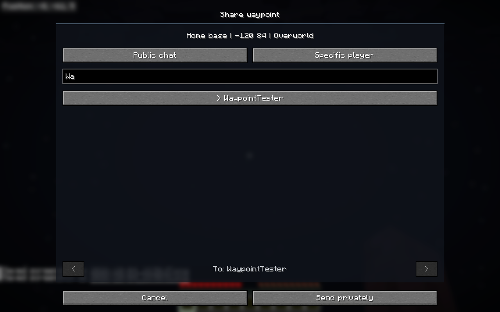
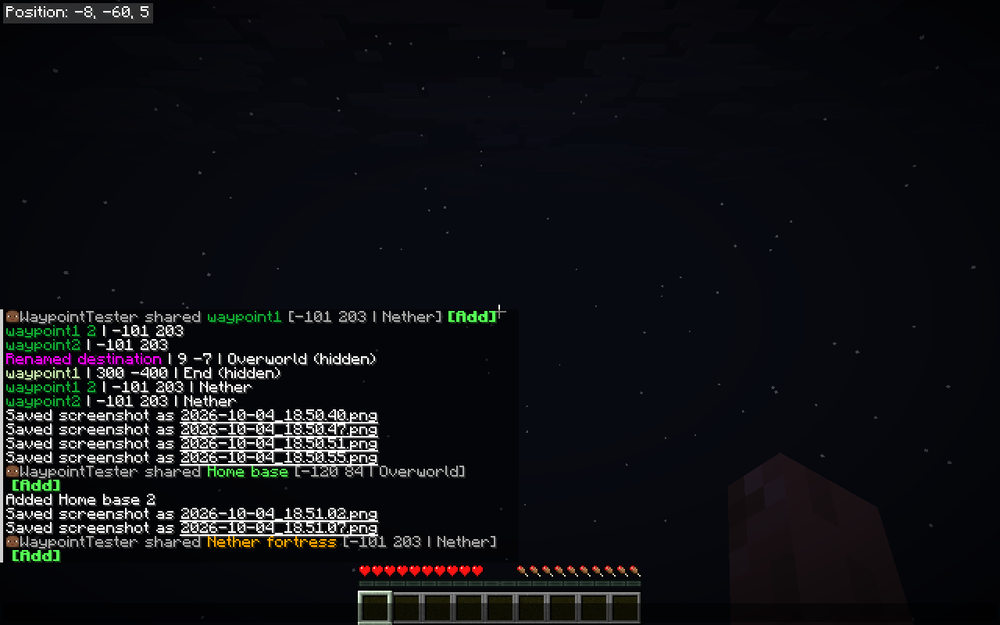

# Command Waypoints +

Create fixed destinations on Minecraft's locator bar using commands or a native waypoint manager. Navigate using horizontal coordinates, with personal waypoints, dimension filters, and chat sharing.

An enhanced Fabric 26.3 fork of [Command Waypoints by Minenash](https://modrinth.com/mod/command-waypoints), maintained by [Vontk](https://github.com/Vontk). This is an independent project.

[Modrinth submission](https://modrinth.com/mod/command-waypoints-plus) — awaiting moderation. [GitHub downloads](https://github.com/Vontk/command_waypoints/releases) are available now.

## Installation and opening the GUI

Use **Minecraft 26.3**, Java 25, Fabric Loader **0.19.5+**, and Fabric API **0.161.0+26.3+**. Put the release jar in `mods` and restart Minecraft. **Replace the original Command Waypoints jar; the two editions cannot be installed together.** Existing waypoint data is retained.

Install [Mod Menu](https://modrinth.com/mod/modmenu) to open **Mods → Command Waypoints + → Config/Settings**. The button opens the main waypoint manager. The manager's **Settings** button opens display preferences and key bindings. Mod Menu is optional; the key bindings work without it.

In a world:

| Default key | Action |
| --- | --- |
| **N** | Open the waypoint manager. |
| **B** | Open the add-waypoint editor, with your current X/Z and dimension filled in. |

Both keys can be changed or unbound in **Options → Controls → Key Binds → Command Waypoints +**, also accessible through **Waypoint settings → Key bindings**. If another mod uses either key, rebind it there. Quick add opens the full editor before saving; it does not silently create a point.

On multiplayer, install this mod and Fabric API on the **server and client**. Personal waypoint commands and the GUI work for non-operators. When connected to a server without the mod, waypoint management is unavailable; display settings remain accessible from Mod Menu. The title-screen manager likewise allows Settings but requires joining a world to create or edit points.

## Waypoint manager



- **Search** filters names and command identifiers as you type.
- The **dimension selector** cycles through **All dimensions** and the dimensions available in the world. Filtering uses the waypoint's saved source dimension, not the dimension in which its converted destination is visible.
- Each row displays its colored name, then **X Z**, with the dimension appended only when viewing all dimensions. Hidden points are marked `(hidden)`. Hover over a row to see its complete name, source dimension, command ID, and personal/shared status.
- Select a row to enable **Edit**, **Show/Hide**, **Share**, and **Delete**.
- **New** opens the same editor as quick add. **Delete** asks for confirmation. **Show/Hide** preserves the saved point and all its properties.
- The list is sorted by name. Page buttons and the mouse wheel navigate long lists.
- **Settings** opens locator-icon size preferences and the native key-binding screen. **Done/Escape** returns to the previous screen or game.

## Creating and editing



The editor exposes every custom waypoint property:

| Property | Behavior |
| --- | --- |
| Name | Empty for a new point. Saving a blank name assigns `waypoint1`, `waypoint2`, etc., choosing the first unused name in the destination's dimension set. Names may contain spaces and up to 80 printable characters. |
| Coordinates | Two whole-number fields, always **X then Z**, each between −30,000,000 and 30,000,000. Height is neither stored by the editor nor used for navigation. |
| Dimension | Source dimension. Defaults to the player's current dimension. Click to cycle through available dimensions, including custom dimensions. Changing it keeps the entered numbers; it does not convert them. |
| Color | Choose a palette swatch or enter six hexadecimal RGB digits, optionally prefixed with `#`. **Auto** clears the override and restores the UUID-derived default color. |
| Display range | Maximum horizontal distance at which the point is visible, in blocks in the viewer's current dimension. Default: 60,000,000. `0` prevents display. The player's vanilla receive-range attribute can impose a lower limit. |
| Icon style | A Minecraft waypoint-style identifier: `minecraft:default`, `minecraft:bowtie`, or one supplied by a resource pack. Editing this field retains support for the command's custom styles. |
| Visible | Toggle the point without deleting it. |

**Current location** fills in the player's current X/Z and dimension. **Reset** restores the values with which the editor opened. **Cancel/Escape** discards unsaved changes. **Save** validates the fields and waits for the server to accept the update; duplicate names, invalid numbers, and unavailable dimensions produce an error while leaving the editor open.

Editing can rename or move a waypoint between dimensions, update its appearance, and change its visibility. The manager’s row tooltip shows the command name, including quotes when needed. Commands accept the readable name directly, including capitals. Quote names containing spaces, such as `"Home Base"`. The `minecraft:` prefix is unnecessary; existing identifiers remain compatible aliases.

## Distance-dependent icons



A custom waypoint's icon stays at its minimum size when its destination is **200 blocks away or farther**, then grows **linearly** as you approach, reaching maximum size at zero distance. Defaults:

| Horizontal distance | Icon size (GUI pixels) |
| --- | --- |
| 200 or more | 6 |
| 100 | 10 |
| 0 | 14 |

Change **Growth distance**, **Minimum size**, and **Maximum size** in **Settings**, then press **Save**. Growth distance must be positive; icon sizes must be 2–32 pixels with maximum at least minimum. Sizes follow the game's GUI scale and update smoothly. Preferences are local to the client and saved in `config/command_waypoints.json`. They apply to this mod's waypoints, leaving vanilla player/entity locator icons unchanged.

A waypoint at distant and near positions:




Distance uses X/Z in the viewer's dimension after portal conversion. Up/down white arrows are suppressed for this mod's destinations, including when looking sharply up or down. Icon appearance still uses the selected vanilla/resource-pack waypoint style.

## Sharing



Select a waypoint and press **Share**:

- **Public chat** sends it to everyone currently online.
- **Specific player** opens a searchable list of currently online players. Type part of a player name, select the recipient, and press **Send privately**. Search is case-insensitive; a disconnected recipient cannot be selected for sending.



Recipients see a formatted message containing the sharer's name, the waypoint's colored name, **X Z**, the source dimension, and a bold green **[Add]** button:



Click **[Add]** to immediately save an independent **personal copy**, including coordinates, dimension, color, style, range, and visibility. A conflicting name gets a numeric suffix. Subsequent editing or deletion by the sender does not change the recipient's copy. Privately shared waypoints can be accepted only by the selected recipient; each recipient can accept a particular share once. The sender receives a private-send confirmation.

Share buttons expire after 24 hours or a server restart. There is a two-second interval between sends to avoid flooding chat. A client without this mod can read the formatted message, but a usable personal copy requires the compatible mod/server setup.

## Commands

The GUI complements commands; the custom syntax does not require `static` or `modify`.

| Command | Action |
| --- | --- |
| `/waypoint add <id>` | Create a visible personal waypoint at your current X/Z and dimension, named `<id>`. |
| `/waypoint goto <id> <dimension> <x> <z>` | Create or move a named destination. Dimension is required: `overworld`, `nether`, or `end`. Existing appearance, range, and visibility are retained. **This does not teleport.** |
| `/waypoint <id> visible <true\|false>` | Show or hide the waypoint. |
| `/waypoint <id> color <color>` | Set a named Minecraft color, e.g. `green`. |
| `/waypoint <id> color hex <RRGGBB>` | Set a hexadecimal RGB color. |
| `/waypoint <id> style reset` | Restore the default icon style. |
| `/waypoint <id> style set <style>` | Set a waypoint-style identifier. |
| `/waypoint <id> range <blocks>` | Set display range from 0 to 60,000,000 blocks. |
| `/waypoint remove <id>` | Delete a waypoint from the current dimension set. |
| `/waypoint list` | List the current dimension set, including each point's source dimension. |
| `/waypoint list <dimension\|all>` | List exactly the selected saved source dimension, or all dimensions. Aliases: `overworld`, `nether`, `end`; full dimension identifiers are also accepted. A specific-dimension list omits the dimension from individual entries. |
| `/waypoint share <id> <player\|all>` | Send a waypoint privately to an online player or publicly to everyone online. |
| `/waypoint accept <token>` | Accept the share represented by a server-issued token; the chat **[Add]** button runs this command automatically. |

Names in command output use the waypoint color. Coordinate pairs are always formatted as `X Z`, e.g. `home | -101 203 | Nether`; the numeric values have no `x:`/`z:` prefixes.

```text
/waypoint add home
/waypoint home color green
/waypoint home visible false
/waypoint home visible true
/waypoint home range 1000
/waypoint goto fortress nether -100 250
/waypoint goto end_city end 1200 -800
/waypoint list nether
/waypoint list all
/waypoint share home Alex
/waypoint share fortress all
```

Waypoint arguments accept readable names, preserving capitals. Quote names containing spaces. Existing identifiers remain accepted as aliases; quote a namespaced alias, such as `"minecraft:home"`. `<style>` still uses a Minecraft identifier. Vanilla entity waypoint commands keep their original syntax and permission requirements.

## Dimensions, personal data, and existing worlds

Overworld and Nether destinations share a set of names for each player and are visible in both dimensions. Nether coordinates are multiplied by **8** in the Overworld, and Overworld coordinates are divided by **8** in the Nether. A Nether destination at `10 -20` therefore appears in the Overworld at `80 -160`. Conversion keeps negative and fractional coordinates internally.

The End has an independent set of names and destinations. End points are visible only in the End; Overworld/Nether points are never shown there. A player can have independent same-name points in the End and the portal dimension set. Other dimensions are isolated in the same way. GUI/list filtering considers saved source dimensions even though portal destinations can be displayed in both dimensions.

New points are **personal**, saved in the world for their owner. Other players do not receive their locator markers or see them in their waypoint lists until a copy is explicitly shared and accepted. Each player can create up to 512 personal points through commands or the GUI.

Existing points from earlier versions remain **legacy shared waypoints** with their original owning dimension and properties. They remain visible/listed to applicable players. Editing these existing shared points requires singleplayer access or server operator permission, and affects everyone receiving the original. Non-operators may share readable legacy points and accept personal copies.

## Source and contributing

Build with Java 25:

```sh
./gradlew :fabric:build
```

The installable jar is in `fabric/build/libs/`. See [testing instructions](TESTING.md) for the separate integration harness. Report bugs and contribute changes at [Vontk/command_waypoints](https://github.com/Vontk/command_waypoints).

## Credits and license

Based on [Command Waypoints](https://github.com/Minenash/command_waypoints) by **Jakob (Minenash)**. The Fabric 26.3 port, waypoint manager, personal sharing, dimension filtering, and configurable distance scaling are maintained in this fork by **Vontk**.

Distributed under **LGPL-3.0-or-later**; see [LICENSE.txt](../LICENSE.txt). Original author attribution and license are preserved.

This fork’s enhancements and documentation were developed with assistance from OpenAI Codex. Interface screenshots are captures from Minecraft.
